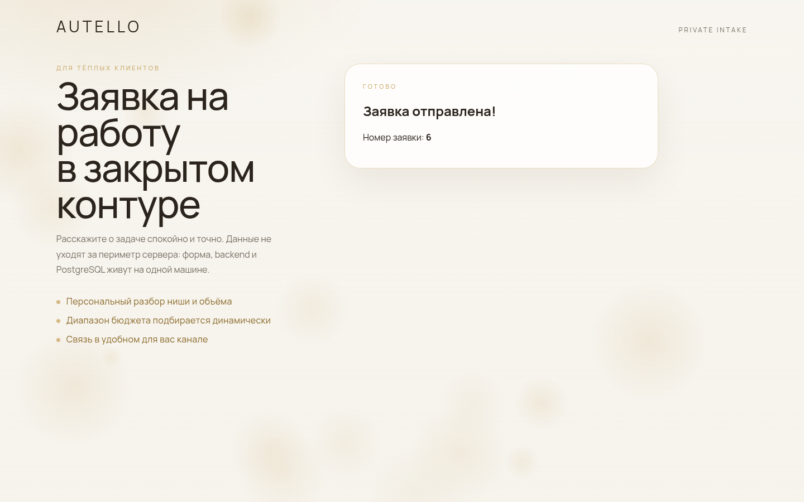
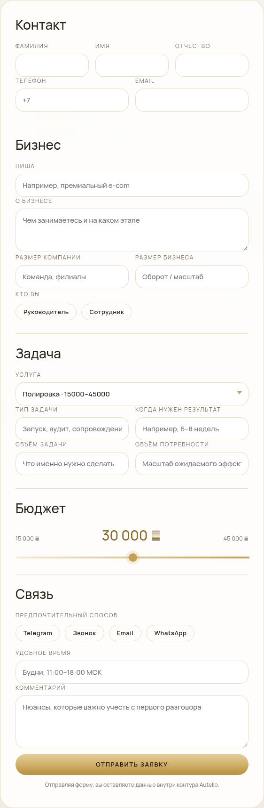
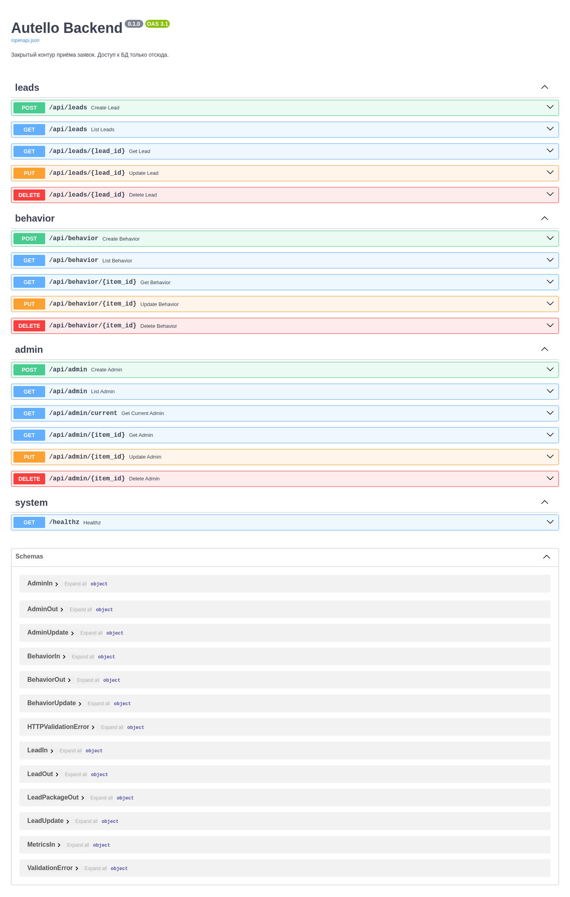

# Обработка заявок клиентов

Закрытый контур приёма лидов: публичная форма, JWT-админка, скоринг «температуры льда» и поведенческие метрики. Данные не покидают сервер.

Демонстрация: [karikovpavel.ru](https://karikovpavel.ru)  
Репозиторий: [github.com/PavelKoff2025/Website_processing_customer_orders](https://github.com/PavelKoff2025/Website_processing_customer_orders)

[](LICENSE)
[](https://docs.docker.com/compose/)
[](https://ubuntu.com/)







---

## Что внутри

Снаружи слушает только **Nginx** (`:80` → HTTPS, `:443` — сайт и API). Backend и PostgreSQL портов на хост не публикуют. pgAdmin и локальный Registry по умолчанию выключены (профиль `ops`).

```
браузер ──► Nginx :80/:443 ──► frontend (форма + /admin.html)
                 └── /api/   ──► backend :8000 (только внутренняя сеть)
                 └── /docs   ──► Swagger
backend ──► Postgres         сеть autello_db, internal
```

| Сервис | Роль |
|--------|------|
| **Nginx** | TLS, статика, прокси `/api/` и `/docs` |
| **Frontend** | Форма заявки и админ-панель (`/admin.html`) |
| **Backend** | FastAPI: заявки, услуги, JWT-админы, метрики, скоринг очереди |
| **PostgreSQL 16** | Хранилище; сеть `internal` без выхода в интернет |
| **Watchtower** | Автообновление только помеченного backend |
| **pgAdmin / Registry** | Опционально, `docker compose --profile ops up -d` |

Нужен плагин **`docker compose`** (через пробел). Старый бинарник `docker-compose` не поддерживается.

### Админка

- Первый администратор регистрируется с `/admin.html`, дальше кнопка регистрации скрывается.
- Вход по логину и паролю, JWT в `Authorization: Bearer`.
- Очередь заявок ранжируется по «температуре льда»: ниша, роль, штат, бюджет, срок. Срочные сверху.
- «Статистика формы» — среднее время на странице за день/неделю/месяц и heatmap курсора.
- Услуги редактируются таблицей CRUD и сразу попадают в селект на главной.

Тестовые заявки для скоринга: [`docs/ice-test-leads.sql`](docs/ice-test-leads.sql) (таблица `leads`).

---

## Быстрый старт

```bash
git clone https://github.com/PavelKoff2025/Website_processing_customer_orders.git
cd Website_processing_customer_orders

./scripts/preflight.sh          # Docker Engine + плагин compose
./scripts/bootstrap.sh          # .env, сертификат, JWT_SECRET

docker compose up --build -d
docker compose ps
```

Секреты живут только в `.env` (в git не попадает). Шаблон — [`.env.example`](.env.example). В `.env` должен быть длинный `JWT_SECRET`.

Фронт после правок:

```bash
cd frontend && npm run build
```

Nginx отдаёт `frontend/dist/` сразу, контейнер фронта перезапускать не нужно.

### Проверка

| Что | Адрес |
|-----|--------|
| Сайт | `https://<хост>/` |
| Админка | `https://<хост>/admin.html` |
| Swagger | `https://<хост>/docs` |
| API услуг | `https://<хост>/api/admin` |
| Заявки | `GET /api/applications/?skip=0&limit=100` (JWT) |
| pgAdmin | `https://<хост>/pgadmin/` — **403**, пока не поднят профиль `ops` |
| Registry | порт `:5000` с хоста закрыт, пока не поднят профиль `ops` |

Прямой заход на backend `:8000` и Postgres `:5432` с хоста не слушается.

Опциональный контур (pgAdmin + registry):

```bash
cd registry
./create-user.sh admin --save-to-env
cd ..
docker compose --profile ops up -d pgadmin registry
```

---

## Структура

```
├── docker-compose.yml
├── .env.example
├── backend/               # FastAPI: модели, CRUD, JWT, метрики
├── frontend/              # Vite: форма, админка; npm run build → dist/
├── nginx/                 # reverse proxy, TLS, лимиты
├── postgres/              # init-скрипты БД
├── pgadmin/               # преднастроенный сервер (профиль ops)
├── registry/create-user.sh
├── scripts/               # bootstrap, certbot, фаервол реестра
├── docs/ice-test-leads.sql
└── frontend/dist/         # готовая статика, её отдаёт Nginx
```

Порты, JWT, интервал Watchtower и доступы к БД задаются в `.env`, а не зашиты в compose.

---

## Безопасность контура

- Сеть `autello_db` с `internal: true` — у Postgres нет маршрута в интернет.
- Backend публикует порт только через `expose`, не через `ports`: с хоста `:8000` не слушается.
- Мутации услуг и чтение заявок/метрик требуют JWT; регистрация закрывается после первого админа.
- Watchtower обновляет лишь контейнеры с меткой `com.centurylinklabs.watchtower.enable`.
- pgAdmin и Registry не входят в закрытый деплой; `/pgadmin/` отвечает 403.

---

## Лицензия

[MIT](LICENSE) © 2026 Pavel Karikov
