# Отчёт по ДЗ — урок VPh06

**Студент:** Павел Кариков  
**Урок:** VPh06 — JWT-админка, CRUD услуг, метрики, скоринг заявок, закрытый деплой  
**Сайт:** [https://karikovpavel.ru/](https://karikovpavel.ru/)  
**Админка:** [https://karikovpavel.ru/admin.html](https://karikovpavel.ru/admin.html)  
**Swagger:** [https://karikovpavel.ru/docs](https://karikovpavel.ru/docs)  
**Репозиторий:** [https://github.com/PavelKoff2025/Website_processing_customer_orders](https://github.com/PavelKoff2025/Website_processing_customer_orders)

Публичная форма из Vph05 осталась на месте. В этом уроке вокруг неё собран служебный контур: вход по JWT, таблица услуг, очередь лидов «по температуре льда», статистика поведения и периметр, где с улицы видны только `80` и `443`.

---

## Чеклист ДЗ

| № | Требование | Статус |
|---|------------|--------|
| 1 | После регистрации кнопка «Зарегистрироваться» исчезает | Выполнено |
| 1 | Авторизация через Swagger UI | Выполнено |
| 2 | ≥ 5 услуг через визуальную таблицу | Выполнено (6) |
| 2 | Редактирование существующей услуги | Выполнено |
| 2 | Удаление услуги — пропадает и с главной | Выполнено |
| 2 | CRUD через эндпоинты | Выполнено |
| 3 | 2–3 минуты на главной, курсор и клики | Выполнено |
| 3 | Статистика день / неделя / месяц + heatmap | Выполнено |
| 3 | Данные в `behavior_metrics` | Выполнено |
| 4 | 10 тестовых заявок, ранжир, карточка, алгоритм льда | Выполнено |
| 5 | `docker compose up --build -d` | Выполнено |
| 5 | Backend `:8000` и Postgres с хоста закрыты | Выполнено |
| 5 | Сайт только через `:443` | Выполнено |
| 5 | pgAdmin и registry выключены | Выполнено |
| 6 | `docker logs`, Nginx, JSON, два терминала | Выполнено |

---

## 1. Авторизация и администрирование

Первый администратор регистрируется с `/admin.html`. Как только в таблице `admins` есть хотя бы одна запись, кнопка **«Зарегистрироваться»** получает `hidden` и в вёрстке не показывается. Под формой остаётся сноска: регистрация доступна, только пока админов нет.

Повторный `POST /api/auth/register` отвечает **403**. Новых сотрудников добавляют уже из вкладки «Администраторы», после входа.

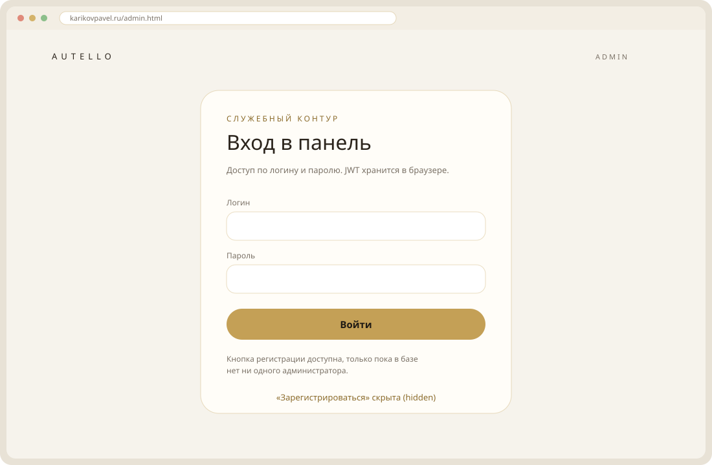

Swagger открывается не на `localhost:8000/docs` — этот порт на хост не опубликован (это требование пункта 5). Рабочий адрес:

[https://karikovpavel.ru/docs](https://karikovpavel.ru/docs)

В UI есть **Authorize** (JWT Bearer). Дальше те же ручки, что дергает админка: `/api/auth/login`, `/api/applications/`, CRUD `/api/admin`, метрики.

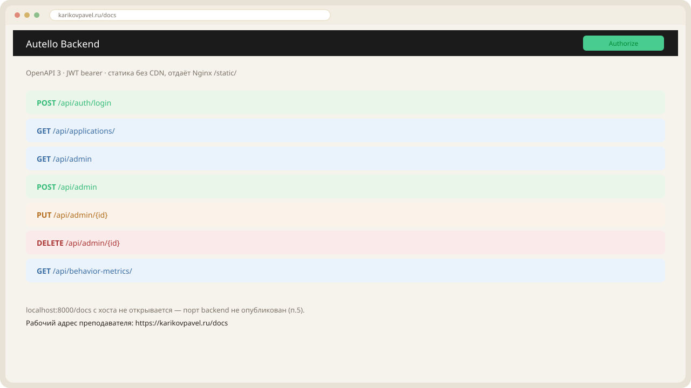

Статика Swagger лежит в `backend/static`, Nginx отдаёт её через `/static/` — без CDN страница `/docs` не белеет.

---

## 2. Управление услугами

В админке вкладка **«Услуги»** — обычная таблица: выбрать строку, «Добавить / Изменить / Сохранить / Удалить». Список сразу кормит селект на главной.

Сейчас шесть боевых позиций:

| ID | Услуга | Мин. | Макс. |
|----|--------|------|-------|
| 7 | Защитная плёнка PPF | 80 000 | 250 000 |
| 5 | Керамика кузова | 45 000 | 140 000 |
| 4 | Химчистка | 8 000 | 25 000 |
| 3 | Полировка | 15 000 | 45 000 |
| 2 | Полная покраска кузова… | 100 000 | 900 000 |
| 1 | Консультация | 100 000 | 10 000 000 |

Что проверялось по ДЗ:

- создана **PPF** (id 7);
- «Керамика» переименована в **«Керамика кузова»**, диапазон **45–140 тыс.**;
- мусорная услуга **`string`** (id 6) удалена — с главной тоже пропала.

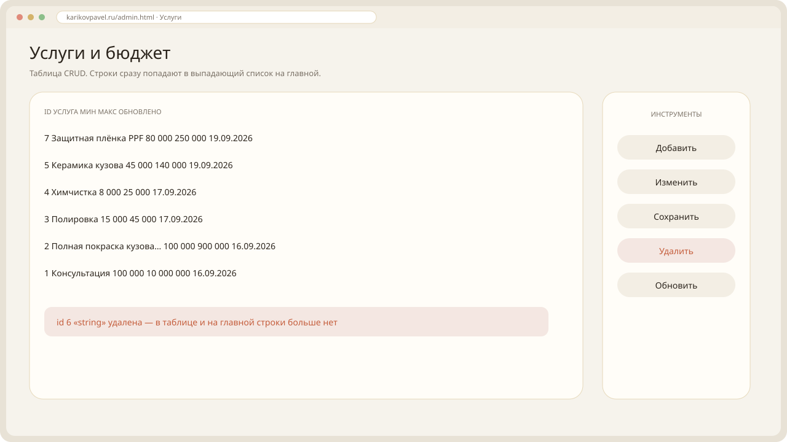

Эндпоинты:

| Метод | Путь | На проверке |
|-------|------|-------------|
| `GET` | `/api/admin` | 200, шесть услуг |
| `POST` | `/api/admin` | 201, PPF |
| `PUT` | `/api/admin/5` | 200, керамика |
| `DELETE` | `/api/admin/6` | 200, `string` снят |

На главной в селекте те же шесть названий. Выбранная услуга сужает слайдер бюджета (PPF — 80–250 тыс.).

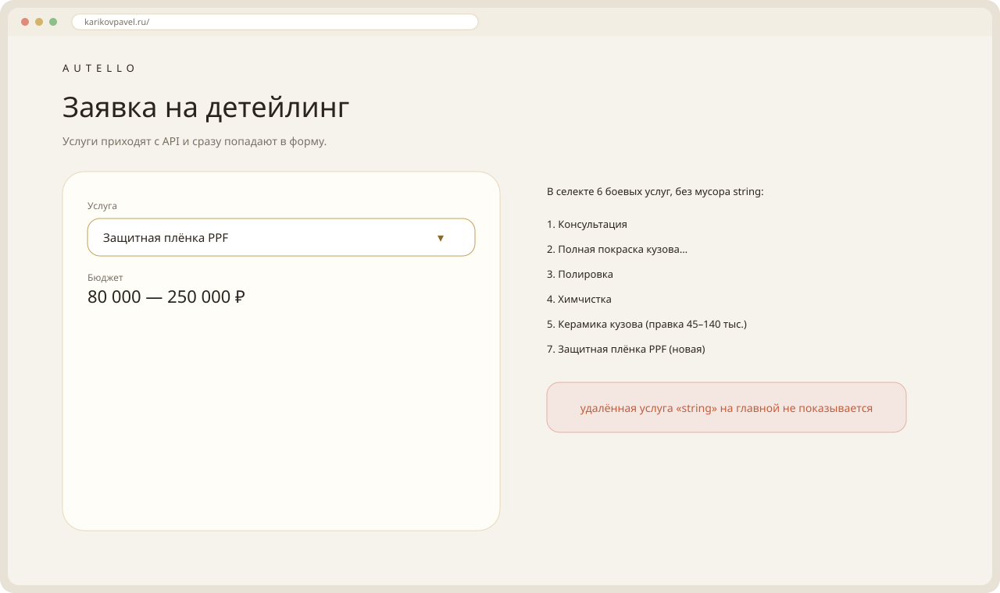

---

## 3. Сбор и анализ метрик

На главной форма крутилась **больше двух минут**: курсор по полям, клики по селекту и кнопкам. Фронт раз в секунду шлёт пакет на `POST /api/behavior-metrics/`. Backend пишет анонимные точки в PostgreSQL, таблица **`behavior_metrics`**.

В админке кнопка **«Статистика формы»**:

| Период | Среднее | Максимум | Визиты |
|--------|---------|----------|--------|
| День | 5 мин 43 сек | 8 мин 38 сек | 2 |
| Неделя | 5 мин 43 сек | 8 мин 38 сек | 2 |
| Месяц | 5 мин 43 сек | 8 мин 38 сек | 2 |

Хитмап не пустой: кружки рисуются по координатам курсора с страницы заказа. Чем крупнее и темнее — тем чаще мышь в этой зоне. Те же данные читаются `GET /api/behavior-metrics/?skip=0&limit=100` (пагинация как у заявок).

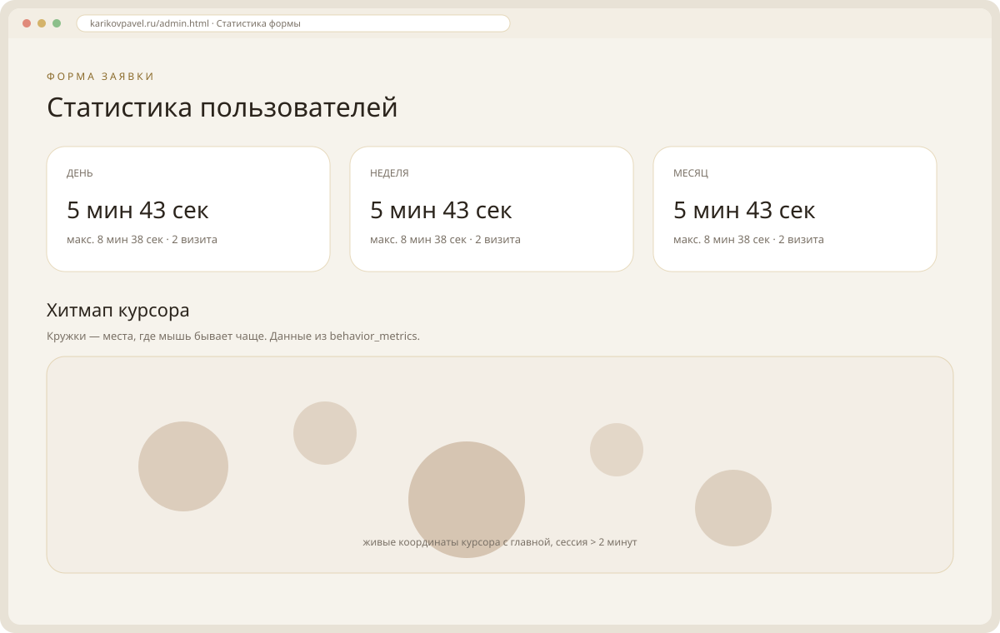

---

## 4. Приоритизация заявок

Список — `GET /api/applications/?skip=0&limit=100`. В базе таблица называется **`leads`** (в формулировке ДЗ — Applications). Скоринг считается на фронте: `analyzeApplication` в `frontend/src/applications.js`.

Десять тестовых людей залиты скриптом [`docs/ice-test-leads.sql`](ice-test-leads.sql) (email `*@test.autello.local`). Повторный запуск безопасен: старые тестовые строки удаляются.

### Как греется лёд

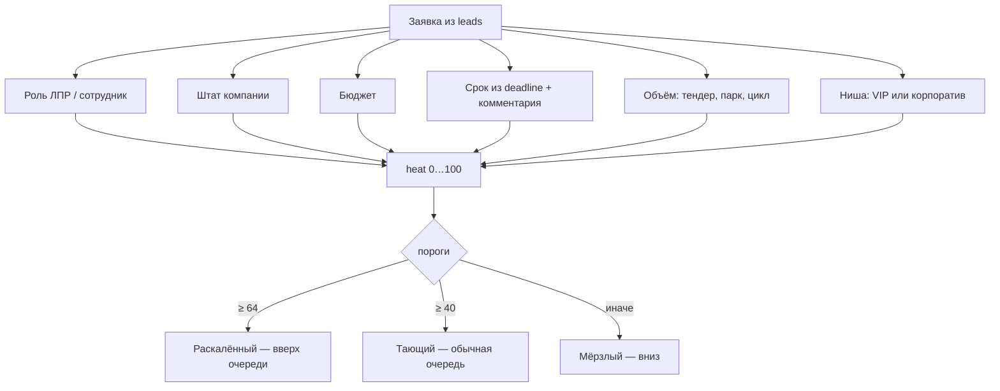

Коротко по баллам:

| Сигнал | Баллы |
|--------|-------|
| Руководитель / ЛПР | +18 |
| Сотрудник закупок | +6 |
| Штат ≥ 200 | +18 |
| Бюджет ≥ 2 000 000 ₽ | +22 |
| Срок ≤ 7 дней | +24 |
| Срок ≤ 21 день | +14 |
| Тендер / автопарк / полный цикл | +10 |
| Корпоратив / VIP | +6 / +8 |

Пороги: **HOT ≥ 64**, **WARM ≥ 40**. Персональный менеджер — если heat ≥ 68 и (ЛПР или крупный штат/чек или VIP). «Тратить время» — heat ≥ 42 или бюджет ≥ 250 000 ₽.

Оборот в поле «размер бизнеса» в штат **не** попадает: `parseHeadcount` отсекает выручку.

### Десять тестовых — живой ранжир

| Место | Клиент | Heat | Лёд | Почему сверху / снизу | Отдел | Перс. менеджер |
|------|--------|------|-----|------------------------|-------|----------------|
| 1 | Волкова Мария Игоревна | 82 | +46° раскалённый | холдинг 250 чел., 4.5 млн | Корп. продажи | да |
| 2 | Соколова Елена Павловна | 76 | +41° раскалённый | банк, 1200 чел., тендер 2.8 млн | Корп. продажи | да |
| 3 | Белов Игорь Андреевич | 72 | +38° раскалённый | VIP / яхты, 950 тыс., 10 дней | VIP | да |
| 4 | Орлов Дмитрий Сергеевич | 66 | +33° раскалённый | срок 3 дня, к пятнице | Опер. цех | нет |
| 5 | Новикова Светлана Алексеевна | 49 | +19° тающий | средний e-com, месяц | Детейлинг | нет |
| 6 | Морозов Андрей Николаевич | 45 | +16° тающий | локальный блог, 3 месяца | Детейлинг | нет |
| 7 | Кузнецова Ольга Викторовна | 43 | +14° тающий | стоматология, 6 недель | Детейлинг | нет |
| 8 | Смирнов Никита Олегович | 17 | −6° мёрзлый | студент, 15 тыс., «не срочно» | Первая линия | нет |
| 9 | Павлов Роман Денисович | 17 | −6° мёрзлый | «пока думаем», 20 тыс. | Первая линия | нет |
| 10 | Козлова Татьяна Юрьевна | 15 | −8° мёрзлый | хобби, 8 тыс., полгода | Первая линия | нет |

Четыре срочных — **разные критерии**, как просили: крупный чек/холдинг, тендер банка, VIP, горящий срок у микробизнеса. Три средних, три холодных.

В очереди рядом лежат ещё боевые заявки с формы, поэтому сводка сейчас **15 / 4 раскалённых / 4 тающих / 7 мёрзлых**, средний heat **43**, 3 персональных менеджера, 9 «стоит времени». Верх списка всё равно тестовый: Волкова → Соколова → Белов → Орлов.

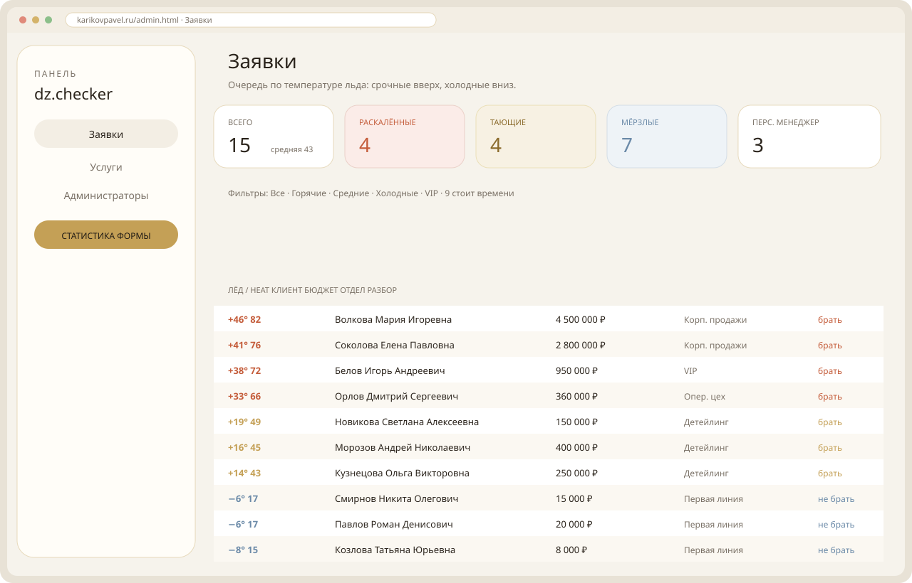

Карточка открывается кликом по строке. Пример — Соколова №9: разбор «брать сегодня», персональный менеджер, отдел корпоративных продаж, сумма баллов по сигналам.

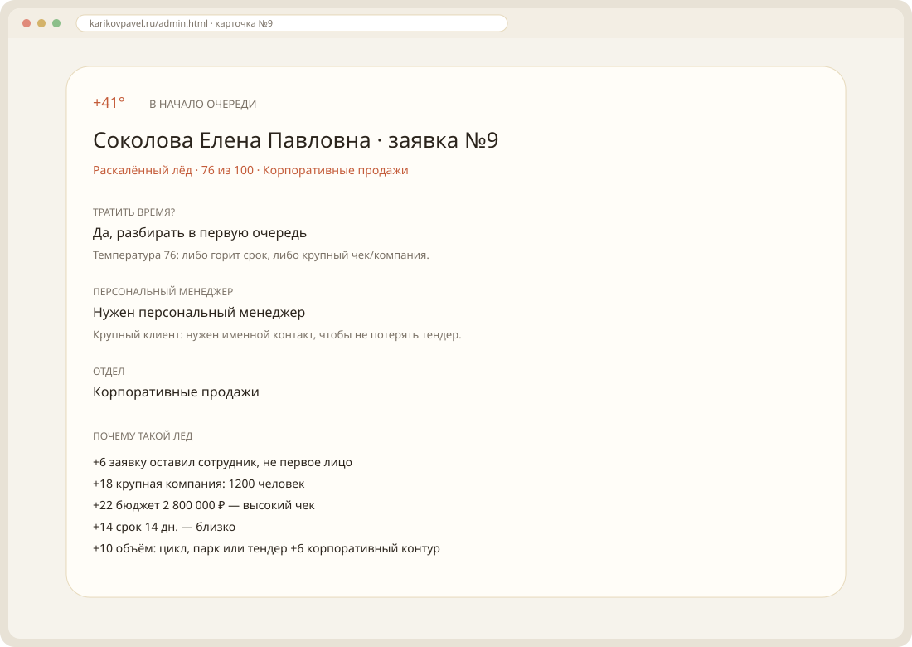

Связь: **Позвонить** / **Написать на почту** — `tel:` и `mailto:` с данных лида.

---

## 5. Безопасность деплоя

Стек пересобран:

```bash
docker compose up --build -d
docker compose ps
```

С хоста слушает только Nginx. Backend и Postgres портов не публикуют (`8000/tcp` и `5432/tcp` без `0.0.0.0`). pgAdmin и Registry вынесены в профиль **`ops`** — в обычном `up` их нет.

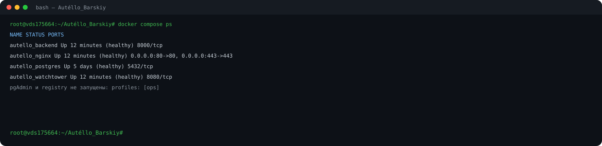

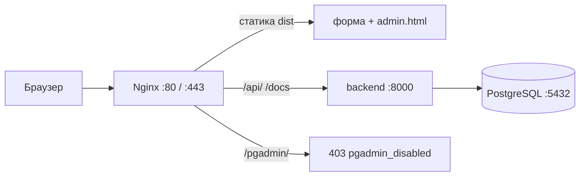

Проверка с хоста:

| Куда | Результат |
|------|-----------|
| `http://127.0.0.1:8000/docs` | **connection refused** |
| `http://127.0.0.1:5432` | **connection refused** |
| `http://127.0.0.1:5000/v2/` | **connection refused** |
| `https://karikovpavel.ru/` | **200** |
| `http://` → сайт | **301** на HTTPS |
| `https://…/pgadmin/` | **403** `pgadmin_disabled` |

В ДЗ для закрытых портов иногда ждут HTTP 403. Здесь строже: порта на хосте нет, TCP не устанавливается. Открывать `:8000` только ради 403 не стали — это хуже периметра. 403 оставлен на `/pgadmin/`, чтобы путь не «дырявил» панель.

Поднять отладку: `docker compose --profile ops up -d pgadmin`.

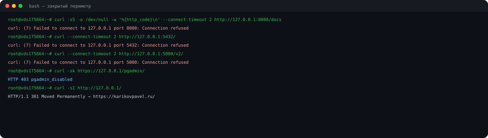

---

## 6. Логи Docker

Имя контейнера — `autello_backend`. Команда из методички `docker logs -f backend` на этой машине контейнер не находит. Два рабочих терминала:

```bash
# терминал 1
docker compose logs -f backend

# терминал 2
docker logs -f autello_nginx
```

Backend пишет JSON/uvicorn. На проверке без 500: `GET /healthz 200`, `GET /api/behavior-metrics/ 200`, ранее в той же сессии — login, CRUD услуг, `GET /api/applications/`. Регистрация второго админа с улицы — **403**.

Nginx access: `GET /docs 200`, `GET /api/admin 200`, `GET / 301` на HTTPS, `GET /pgadmin/ 403` (17 байт тела — ровно `pgadmin_disabled\n`).

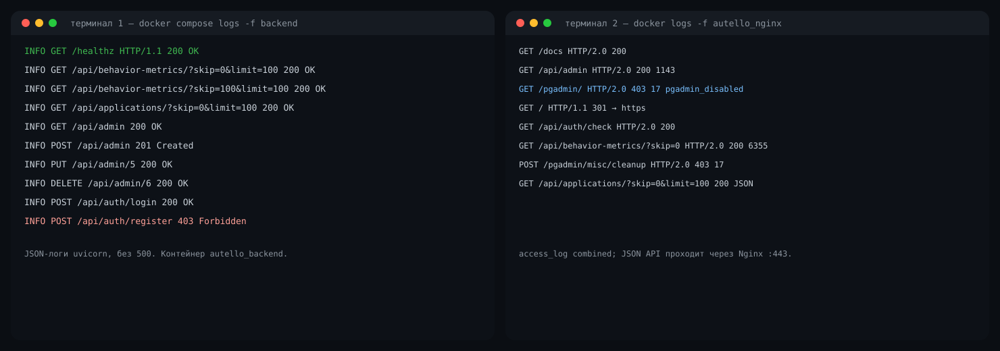

---

## Что смотреть преподавателю

| Что | Где |
|-----|-----|
| Форма | [karikovpavel.ru](https://karikovpavel.ru/) |
| Админка | [karikovpavel.ru/admin.html](https://karikovpavel.ru/admin.html) |
| Swagger + Authorize | [karikovpavel.ru/docs](https://karikovpavel.ru/docs) |
| Список услуг | [karikovpavel.ru/api/admin](https://karikovpavel.ru/api/admin) |
| SQL тестовых лидов | [`docs/ice-test-leads.sql`](ice-test-leads.sql) |
| Код | [GitHub — Website_processing_customer_orders](https://github.com/PavelKoff2025/Website_processing_customer_orders) |

Скриншоты этого отчёта — в [`docs/images`](images): `vph06-01` … `vph06-10`. Цифры сняты с живого контура 19 сентября 2026.
