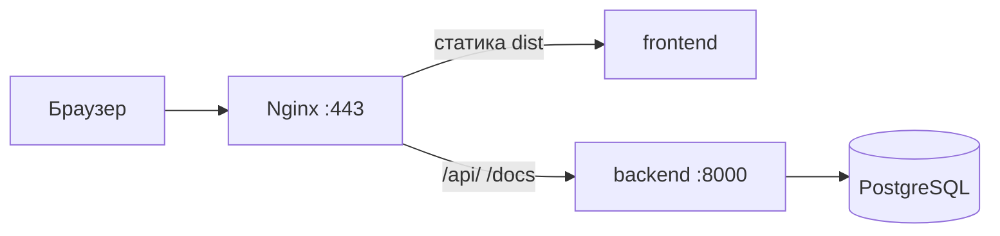
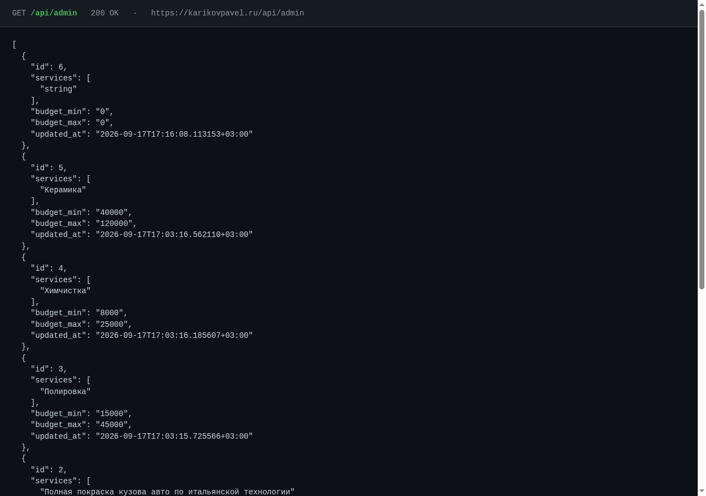
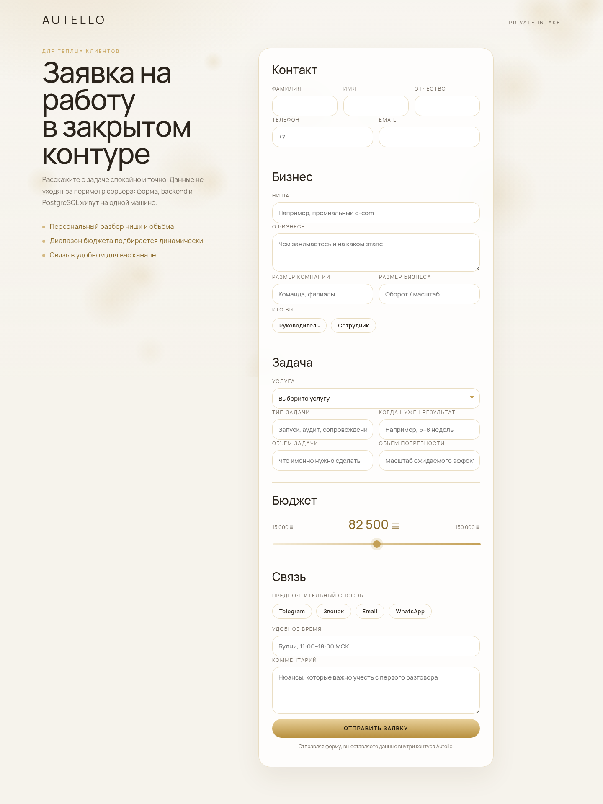

# Отчёт по ДЗ — урок Vph05

**Студент:** Павел Кариков  
**Урок:** Vph05 — backend, сборка фронтенда, прокси API, приём заявки  
**Сайт:** [https://karikovpavel.ru/](https://karikovpavel.ru/)  
**Swagger:** [https://karikovpavel.ru/docs](https://karikovpavel.ru/docs)  
**Репозиторий:** [https://github.com/PavelKoff2025/Website_processing_customer_orders](https://github.com/PavelKoff2025/Website_processing_customer_orders)

Инфраструктура (Nginx, PostgreSQL, pgAdmin, Registry) уже была развёрнута раньше. В этом уроке контур доведён до рабочей заявки: FastAPI пишет в Postgres, фронт собирается в `dist`, Nginx отдаёт CSS и проксирует API.

---

## Чеклист ДЗ

| № | Требование | Статус |
|---|------------|--------|
| 1 | Контейнеры `backend` и `db` запущены и видят друг друга | Выполнено |
| 1 | Через Swagger созданы ≥ 3 услуги с разными ценами | Выполнено |
| 1 | `GET` отдаёт этот список услуг | Выполнено |
| 2 | Элитный стиль: белая тема, округлые шрифты, анимация | Выполнено |
| 2 | Сборка `npm run build` | Выполнено |
| 2 | CSS подгружается, без 404 | Выполнено |
| 3 | Nginx проксирует API (нет 405 / 307 на `POST /api/leads`) | Выполнено |
| 3 | На главной выбрана услуга, форма отправлена | Выполнено |
| 3 | Сообщение «Заявка отправлена!» | Выполнено |
| 4 | Разбор через `docker logs` | Выполнено |

---

## 1. Подготовка и бэкенд

### Контейнеры видят друг друга

`backend` и `postgres` в статусе **healthy**. Backend ходит в БД по Docker DNS (`postgres:5432`), порт `8000` наружу **не опубликован** (`expose`, не `ports`). С браузера API доступен только через Nginx.

```text
NAME                 IMAGE                                         STATUS
autello_backend      …/autello/backend:latest                      Up (healthy)   8000/tcp
autello_postgres     postgres:16-alpine                            Up (healthy)   5432/tcp
autello_nginx        nginx:1.27-alpine                             Up (healthy)   80, 443
```

Проверка связи: из контейнера backend открывается TCP к `postgres:5432`, `GET /healthz` отвечает `{"status":"ok"}`.




### Три услуги через Swagger

Открыт [https://karikovpavel.ru/docs](https://karikovpavel.ru/docs). Swagger собран **без CDN**: JS и CSS лежат в `backend/static`, Nginx отдаёт их через `location ^~ /static/`. Иначе в Яндекс.Браузере страница `/docs` оставалась белой.

Через `POST /api/admin` созданы три услуги с разными диапазонами:

| Услуга | Мин. цена | Макс. цена |
|--------|-----------|------------|
| Полировка | 15 000 | 45 000 |
| Химчистка | 8 000 | 25 000 |
| Керамика | 40 000 | 120 000 |


### GET отдаёт список

`GET https://karikovpavel.ru/api/admin` → **200**. В ответе есть Полировка, Химчистка и Керамика с указанными диапазонами. Этот же список фронт кладёт в выпадающее поле «Услуга».



---

## 2. Фронтенд и сборка

### Элитный стиль

Форма на Vite: светлый фон `#f6f3ec`, шрифт **Manrope** (локальные `.woff2`, без Google Fonts), поля со скруглением **18px**, золотой акцент, canvas с плавающими кругами.



Выпадающий список услуг приходит с API. После выбора «Полировка» слайдер бюджета сужается до 15 000–45 000.


### `npm run build`

Сборка на сервере (Node 22, не macOS):

```bash
cd frontend
npm run build
```

Результат — `frontend/dist/`. Nginx монтирует эту папку как корень сайта. Vite кладёт стили в `/assets/index-….css`.

### Чек-поинт CSS (ошибка 404 из урока)

В уроке CSS часто даёт **404**: regex Nginx забирает `*.css` и ищет файл не там, либо Webpack не выносит CSS в отдельный файл.

У нас:

1. Vite сам выносит CSS (аналог `mini-css-extract-plugin`).
2. В Nginx для статики:

```nginx
location ~* \.(?:css|js|mjs|woff2?|ttf|svg|png|jpe?g|webp|avif|ico)$ {
    try_files $uri =404;
}
```

Проверка с живого сайта:

| Файл | Код |
|------|-----|
| `/` | 200, `text/html` |
| `/assets/index-DpL37fF7.css` | **200**, `text/css` |
| шрифты `.woff2` | **200**, `font/woff2` |

Страница не «голая»: фон кремовый, скругления и шрифт видны на скринах выше.

---

## 3. Интеграция и тестирование

### Прокси API: 405 и 307

Типичные ошибки урока:

- **307 Redirect** — FastAPI редиректит `/api/leads/` → `/api/leads`, POST превращается в GET.
- **405 Not Allowed** — Nginx не пропускает POST на этот путь (или редирект HTTP→HTTPS на POST).

Что сделано:

1. У FastAPI `redirect_slashes=False` — редиректа со слэшем нет.
2. Отдельный точный location без завершающего слэша:

```nginx
location = /api/leads {
    set $backend_host backend;
    proxy_pass http://$backend_host:8000;
}
```

3. Остальной API — `location /api/` на тот же backend.

Проверка:

| Запрос | Результат |
|--------|-----------|
| `POST /api/leads` | **201 Created**, редиректа нет |
| `POST /api/leads/` (со слэшем) | 404, не 307 и не 405 |

Форма шлёт `fetch("/api/leads")` без слэша, с той же страницы HTTPS — CORS не нужен.

### Сценарий с главной

1. Открыта [главная](https://karikovpavel.ru/).
2. В списке выбрана **Полировка**.
3. Заполнены ФИО, телефон, email, ниша, комментарий.
4. Нажато «Отправить заявку».

Пакет ушёл одним `POST /api/leads`: поля формы + метрики (время на странице, клики, user-agent). Backend записал лид и поведение в Postgres с одним и тем же `id`.

### Сообщение об успехе

Точный текст из ДЗ:


Заявка сохранилась (пример: номер **6**, услуга «Полировка», бюджет `30000`).

---

## 4. Работа с логами

Имя контейнера — `autello_backend`. Команда из ДЗ `docker logs -f backend` на этой машине не находит контейнер. Рабочие варианты:

```bash
docker compose logs -f backend
docker logs -f autello_backend
```

В логах backend на проверке ДЗ не было 500 / CORS. Видно штатное:

```text
GET  /api/admin      200 OK
POST /api/admin      201 Created     ← три услуги
POST /api/leads      201 Created     ← заявка с формы
GET  /docs           200 OK
```

Nginx access: `POST /api/leads HTTP/2.0` **201**, referer `https://karikovpavel.ru/`.

---

## Что смотреть преподавателю

| Что | Где |
|-----|-----|
| Форма | [karikovpavel.ru](https://karikovpavel.ru/) |
| Swagger | [karikovpavel.ru/docs](https://karikovpavel.ru/docs) |
| Список услуг | [karikovpavel.ru/api/admin](https://karikovpavel.ru/api/admin) |
| Код | [GitHub — Website_processing_customer_orders](https://github.com/PavelKoff2025/Website_processing_customer_orders) |

Скриншоты этого отчёта лежат в [`docs/images`](images): `06`–`10b` и `02-docker-ps.svg`.
