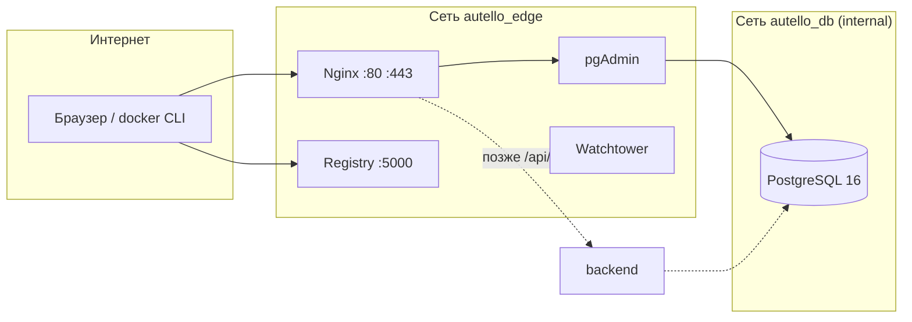
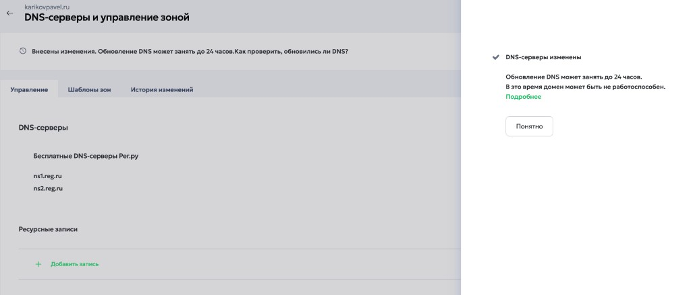
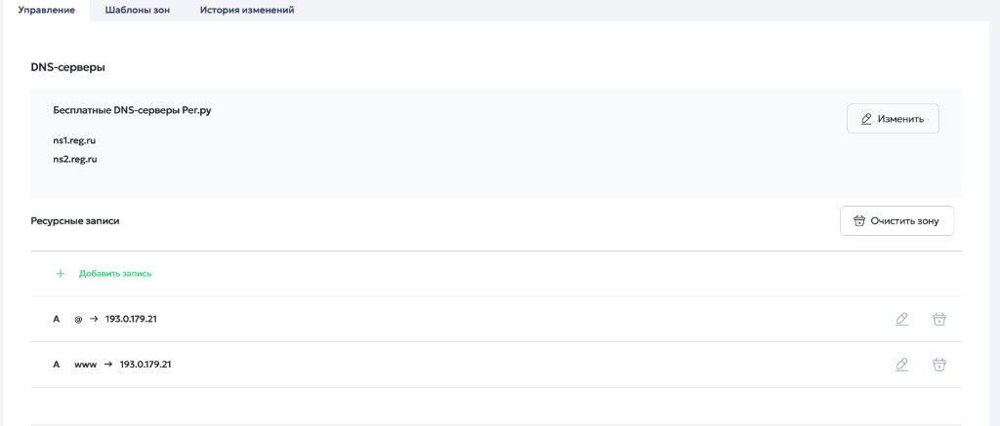
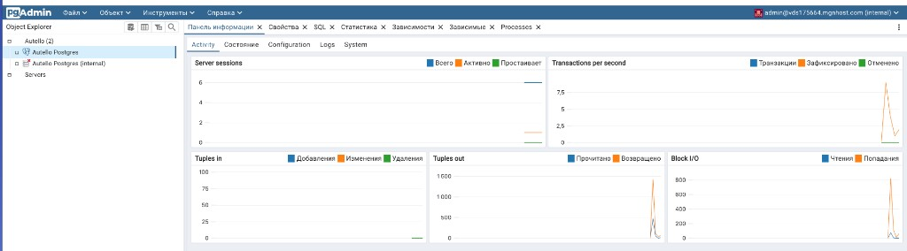
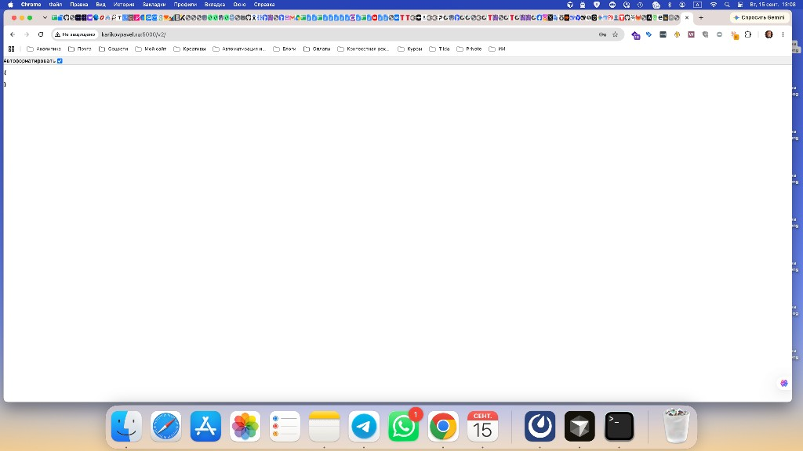

# Отчёт по выполнению домашнего задания

**Курс / тема:** инфраструктура контура приёма заявок (Nginx, PostgreSQL, pgAdmin, Watchtower, Docker Registry)  
**Студент:** Павел Кариков  
**Сервер:** VPS MNGHost, Ubuntu 22.04.5 LTS, `193.0.179.21` (`vds175664.mgnhost.com`)  
**Домен:** [karikovpavel.ru](https://karikovpavel.ru)  
**Репозиторий:** [github.com/PavelKoff2025/Website_processing_customer_orders](https://github.com/PavelKoff2025/Website_processing_customer_orders)  
**Срок работ:** 14–15 сентября 2026  

---

## 1. Цель

Развернуть на арендованном VPS закрытый контур:

- страница для «тёплых» клиентов с формой заявки;
- запись лидов в PostgreSQL только через Backend;
- доступ к API снаружи исключительно через Nginx;
- контейнеры изолированы, данные клиентов не покидают сервер;
- локальный Docker Registry с входом через `docker login`, доступный с рабочей машины.

На этом этапе Backend ещё не деплоится (в `docker-compose.yml` оставлен закомментированным). Инфраструктура и проверки ДЗ выполнены полностью.

---

## 2. Аренда сервера (MNGHost)

Зарегистрирован и арендован самый доступный VPS:

| Параметр | Значение |
|----------|----------|
| Хостер | **MNGHost** |
| Hostname | `vds175664.mgnhost.com` |
| Публичный IP | `193.0.179.21` |
| ОС | Ubuntu 22.04.5 LTS |
| Доступ | root по SSH |

Требование ДЗ («например ihor.online или reg.ru») — про пример хостера. Выбран MNGHost, образ Ubuntu 22.04 соблюдён.

---

## 3. Доступ: Remote-SSH и ключ вместо пароля

К серверу подключались из **Cursor** расширением Remote-SSH (алиас `karikov` на локальной машине).

Авторизация root переведена на SSH-ключ:

- `PubkeyAuthentication yes`
- `PasswordAuthentication no`
- `PermitRootLogin prohibit-password`

Вход по паролю отключён: только ключ из `authorized_keys`.

---

## 4. Окружение: Docker и плагин Compose

Установлены:

- Docker Engine **29.8.0**
- плагин **`docker compose` v5.5.1** (через пробел)

Старый бинарник `docker-compose` (v1) **не используется**. В проекте есть `scripts/preflight.sh`: он падает, если плагина нет, и предупреждает про legacy-клиент. Это закрывает требование ДЗ явно прописать плагин, а не v1.

---

## 5. Инфраструктура

Файл [`docker-compose.yml`](../docker-compose.yml) описывает пять сервисов ДЗ.



| Сервис | Образ | Снаружи |
|--------|--------|---------|
| Nginx | `nginx:1.27-alpine` | `:80`, `:443` |
| Postgres | `postgres:16-alpine` | порт **не опубликован** |
| pgAdmin | `dpage/pgadmin4:8.12` | только `https://…/pgadmin/` |
| Registry | `registry:2.8` | `:5000` HTTP + `docker login` |
| Watchtower | `nickfedor/watchtower:1.22.1` | без публичного порта |

Сеть `autello_db` помечена `internal: true`: у контейнера Postgres нет шлюза в интернет. Данные лидов физически не могут уйти «сами» через NAT.

Порты, интервал Watchtower и креды вынесены в `.env`, а не зашиты в YAML.

### Запущенные контейнеры


Все пять контейнеров в статусе `Up` / `healthy`, без цикла `Restarting`.

---

## 6. Файл `.env`

Создан `scripts/bootstrap.sh` (случайные пароли) и проверен на полноту:

- PostgreSQL: `POSTGRES_DB`, `POSTGRES_USER`, `POSTGRES_PASSWORD`, `POSTGRES_HOST`, `POSTGRES_PORT`
- pgAdmin: логин панели + Basic Auth Nginx
- Registry: пользователь `admin`, отдельный пароль (не пароль БД)
- публичные порты `HTTP_PORT` / `HTTPS_PORT` / `REGISTRY_PORT`
- `WATCHTOWER_ARGS` (тип обновления)

Рабочий `.env` **не попадает в git** (см. `.gitignore`). В репозитории только `.env.example`.

---

## 7. Пользователь локального реестра

По ТЗ:

```bash
cd registry
./create-user.sh admin
```

Скрипт лежит в [`registry/create-user.sh`](../registry/create-user.sh). Он пишет bcrypt-хеш в `registry/auth/htpasswd` (формат, который понимает `registry:2`). Пользователь **`admin`** создан, вход `docker login` и браузерный Basic Auth работают.

Реестр опубликован **напрямую на `:5000`** (как в эталоне преподавателя), без TLS на этом порту.

---

## 8. Домен karikovpavel.ru и DNS

Домен зарегистрирован на **Reg.ru** специально для урока. Сначала зона жила на хостинговых NS (`ns1.hosting.reg.ru`) и смотрела на заглушку `31.31.196.109`.

Сделано:

1. DNS-серверы сменены на бесплатные **ns1.reg.ru / ns2.reg.ru**.
2. A-записи `@` и `www` → **`193.0.179.21`**.





После пропагации (на следующий день):

```text
nslookup karikovpavel.ru 8.8.8.8
Address: 193.0.179.21
```

Выпущен **Let's Encrypt** (`./scripts/issue-certs.sh --with-www`) на `karikovpavel.ru` и `www`, до 14.12.2026. Сайт открывается по HTTPS без предупреждения браузера.

---

## 9. Проверка из браузера

### Сайт

[https://karikovpavel.ru/](https://karikovpavel.ru/) — заглушка фронтенда за Nginx, сертификат Let's Encrypt.

### pgAdmin

Адрес: [https://karikovpavel.ru/pgadmin/](https://karikovpavel.ru/pgadmin/)

Два шага входа (так и задумано):

1. Basic Auth Nginx;
2. логин самой панели pgAdmin.

Подключение к БД: хост `postgres`, пользователь `autello`, база `autello`. Панель видит сервер **Autello Postgres (internal)** и рисует Activity — контур замкнут.



### Docker Registry

Адрес: [http://karikovpavel.ru:5000/v2/](http://karikovpavel.ru:5000/v2/)  
(обязательно схема **http://**, не https)

После логина `admin` API отвечает пустым JSON `{}` — штатный ответ Registry v2 «сервис жив, вы авторизованы». Отдельного HTML-интерфейса у реестра нет.



---

## 10. Что ломалось и как чинили

Это часть работы, её полезно показать преподавателю: стек не «магически завелся».

| Проблема | Причина | Решение |
|----------|---------|---------|
| Watchtower в `Restarting` | Образ `containrrr/watchtower` архивен, с Docker 29 запрашивает API 1.25 при минимуме 1.40 | Форк `nickfedor/watchtower:1.22.1` |
| Паника registry на скрине преподавателя | `REGISTRY_AUTH=htpasswd` без `REALM` или `PATH` | Оба параметра заданы в compose |
| Пустая панель pgAdmin (404 на `.js`/`.css`) | Regex Nginx для статики перехватывал файлы `/pgadmin/` | `location ^~ /pgadmin/` и редирект `/pgadmin` → `/pgadmin/` |
| `ERR_SSL_PROTOCOL_ERROR` на `:5000` | HSTS с сайта 443 заставлял Chrome ходить на реестр по HTTPS | HSTS снят; в браузере открывать `http://…:5000/v2/` |
| DNS «не тот сайт» | Домен ещё указывал на хостинг Reg.ru | Смена NS и A-записей на IP VPS |

---

## 11. Репозиторий для сдачи

Код выложен в публичный репозиторий:

**https://github.com/PavelKoff2025/Website_processing_customer_orders**

- лицензия **MIT**;
- About: «Контур приёма заявок: Nginx, PostgreSQL, pgAdmin, Watchtower и локальный Docker Registry»;
- homepage: `https://karikovpavel.ru`;
- секреты (`.env`, сертификаты, htpasswd) в git не входят.

---

## 12. Соответствие пунктам ДЗ

| Пункт ДЗ | Статус |
|----------|--------|
| VPS Ubuntu 22.04 | Выполнено (MNGHost) |
| Remote-SSH + SSH-ключ для root | Выполнено |
| Docker + плагин docker compose | Выполнено (v5.5.1) |
| compose: Nginx, Postgres, pgAdmin, Watchtower, Registry | Выполнено |
| `.env` с доступами к БД | Выполнено |
| `registry/create-user.sh` | Выполнено, пользователь `admin` |
| `docker compose up -d`, доступ к Registry и pgAdmin | Выполнено |

---

## Как повторить у себя

```bash
git clone https://github.com/PavelKoff2025/Website_processing_customer_orders.git
cd Website_processing_customer_orders
./scripts/preflight.sh
./scripts/bootstrap.sh
cd registry && ./create-user.sh admin --save-to-env && cd ..
docker compose up -d
docker ps
```
